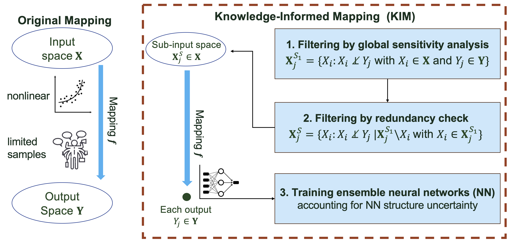

# KIM: A Knowledge-Informed Mapping toolkit

KIM is a Knowledge-Informed Mapping toolkit in Python to optimize the development of the mapping $ƒ$ from a vector of inputs $\mathbf{X}$ to a vector of outputs $\mathbf{Y}$. KIM mainly builds on the methodology development of deep learning-based inverse mapping in {cite:t}`Jiang:2023` and {cite:t}`Wang:2025`. It involves two key procedures: (1) an exploratory data analysis using information theory to identify the dependency between $\mathbf{X}$ and $\mathbf{Y}$ and filter out both insignificant and redundant inputs through global sensitivity analysis and conditional independence testing; and (2) ensemble learning of $ƒ$ using neural networks to account for its structural uncertainty. KIM is mostly rewritten in [JAX](https://github.com/jax-ml/jax) and also supports basic parallel computing on CPU cores for statistical significance test and ensemble learning by using [Joblib](https://joblib.readthedocs.io/en/stable/).

## Scientific motivation
Striving for scientific hypothesis testing and discovery, Earth scientists oftentimes develop data-driven mappings -- either for inverse modeling, as part of model calibration, or forward modeling, as an emulator. Both approaches benefit from an efficient way of mapping, $ƒ$, that projects from a vector of inputs $\mathbf{X}$ to a vector of outputs $\mathbf{Y}$. While the forward modeling focuses on developmeng an emulator, the inverse modeling involves developing a mapping from model outputs to model parameters, such that once trained, the mapping can directly infer the parameters based on observations. Such mapping approach has seen successes in addressing inverse and forward problems in multiple studies across Earth sciences {cite}`Krasnopolsky:2003,HU:2014,Cromwell:2021,Mudunuru:2022`.

Nevertheless, constructing the mapping $ƒ$ that connects all inputs $\mathbf{X}$ to all outputs $\mathbf{Y}$ is usually challenging due to (1) limited data/simulations for training; (2) uninformative relations between some members of $\mathbf{X}$ and $\mathbf{Y}$; and (3) the structural uncertainty of $ƒ$. To that, {cite:t}`Jiang:2023` and {cite:t}`Wang:2025` leveraged the idea of integrating scientific knowledge with deep learning {cite:t}`Willard:2022` to develop knowledge-informed mapping (KIM) by using (1) information theory to uncover the dependencies between $\mathbf{X}$ and $\mathbf{Y}$ that guides the design of $f$ and (2) ensemble learning to account for uncertainty due to the model structure error of $f$. The goal of this package is to open source such an easy-to-use tool.

<!-- { width=80% } -->
<!-- <figure>
  
  <figcaption><strong>Figure 1.</strong> Comparison between KIM and the original mapping.</figcaption>
</figure> -->
:::{figure} ./figures/Figure-KIM.png
:name: fig-kim
:width: 80%
:align: center

Comparison between KIM and the original mapping.
:::

```{tableofcontents}
```
