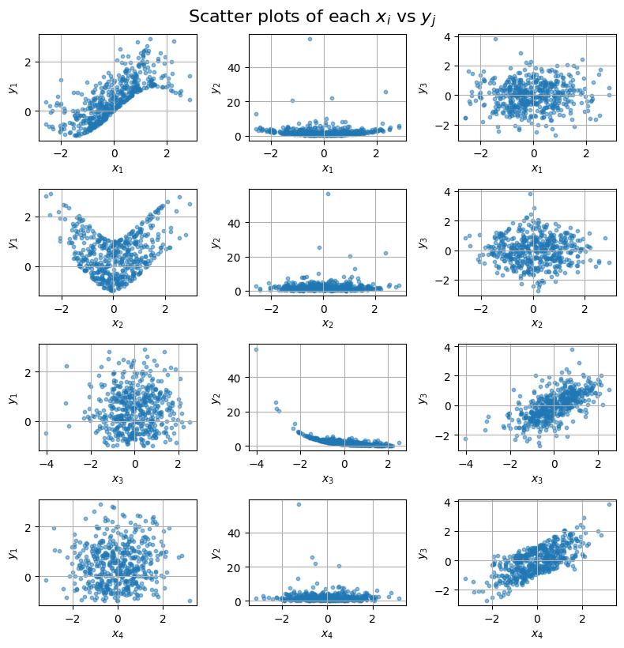

# Performing the preliminary analysis

We first perform the preliminary data analysis. Depending on the configurations, this procedure potentially involves the following two steps: (1) a global sensitivity analysis and (2) redundancy check using conditional mutual information.

# Consider a multivariate model
## Model Overview

Let the input vector be:  
**x** = [x₁, x₂, x₃, x₄]

Let the output vector be:  
**y** = [y₁, y₂, y₃]

The model is defined as:

- y₁ = sin(x₁) + log(1 + x₂²)  
- y₂ = exp(−x₃) + 0.5 · x₁²  
- y₃ = x₄ / (1 + x₂²) + tanh(x₃)

## Dependencies

- **y₁** depends on **x₁** and **x₂** only  
- **y₂** depends on **x₁** and **x₃** only  
- **y₃** depends on **x₂**, **x₃**, and **x₄**

Thus, not all inputs are important for all outputs — this creates a **sparse input-output dependency structure**.

Let's first define a python function for the model
```python
import numpy as np
def multivariate_nonlinear_model(x):
    """
    Multivariate nonlinear model with 4 inputs and 3 outputs.
    
    Parameters:
        x : ndarray of shape (..., 4)
            Input array where each row corresponds to a 4-dimensional input.
    
    Returns:
        y : ndarray of shape (..., 3)
            Output array with 3 outputs per input row.
    """
    x = np.asarray(x)
    x1, x2, x3, x4 = x[..., 0], x[..., 1], x[..., 2], x[..., 3]

    y1 = np.sin(x1) + np.log(1 + x2**2)
    y2 = np.exp(-x3) + 0.5 * x1**2
    y3 = x4 / (1 + x2**2) + np.tanh(x3)

    y = np.stack([y1, y2, y3], axis=-1)
    return y
```

## Preparing the inputs and outputs
Then, generate 500 realizations by randomly sampling **x** from standard normal distribution.

```python
Ns = 500  # Number of samples
Nx = 4  # Number of input variables
Ny = 3  # Number of output variables

# Inputs and outputs
x = np.random.randn(Ns, Nx)
y = multivariate_nonlinear_model(x)
```

Visualize them to see their relationships.

```python
# Now, let's plot them
import matplotlib.pyplot as plt
fig, axes = plt.subplots(nrows=4, ncols=3, figsize=(8, 8))
for i in range(4):   # x1 to x4
    for j in range(3):  # y1 to y3
        ax = axes[i, j]
        ax.scatter(x[:, i], y[:, j], alpha=0.5, s=10)
        ax.set_xlabel(f"$x_{i+1}$")
        ax.set_ylabel(f"$y_{j+1}$")
        ax.grid(True)
plt.tight_layout()
plt.suptitle("Scatter plots of each $x_i$ vs $y_j$", fontsize=16, y=1.02)
```
<!-- <figure>
  
</figure> -->
:::{figure} ./figures/tutorial_scatterplot.png
:width: 80%
:align: center
:::

## Configuring the preliminary analysis
Before performing the preliminary analysis, we first provides the parameters for the analysis. The detailed configurations can be found in this [post](./configs.md)

- Data configuration
```python
data_params = {
    "xscaler_type": "minmax",  # scaler for the x (input) data
    "yscaler_type": "minmax",  # scaler for the y (output) data
}
```

- Preliminary analysis configuration
```python
sensitivity_params = {
    "method": "pc", "metric": "it-knn",
    "sst": True, "ntest": 100, "alpha": 0.05, "k": 3,
    "n_jobs": 4, "seed_shuffle": 1234,
    "verbose": 1
}
```

## Run the preliminary analysis
```python
from kim import Data
data = Data(x, y, **data_params)
data.calculate_sensitivity(**sensitivity_params)
```

## Save the results
```python
from pathlib import Path
f_data_save = Path('./data')
data.save(f_data_save)
```

