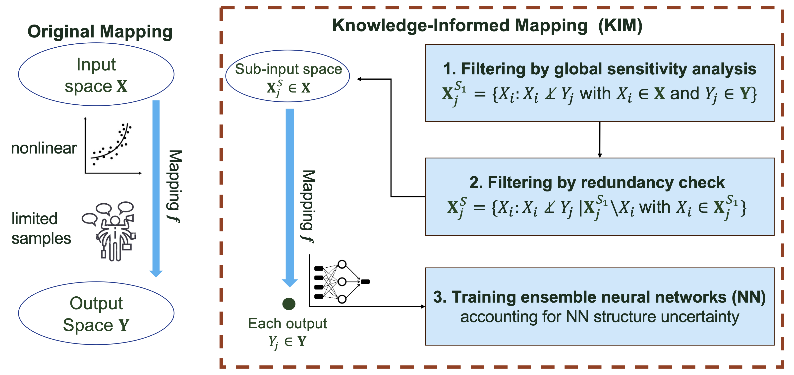
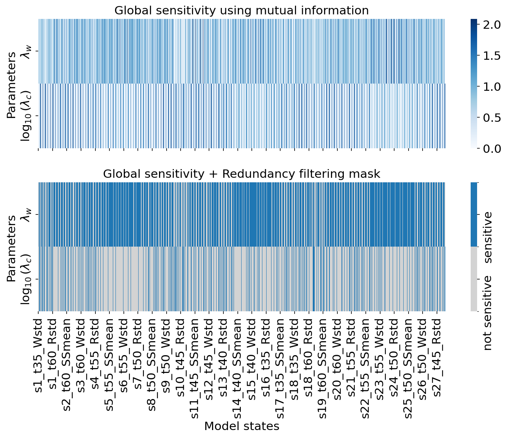
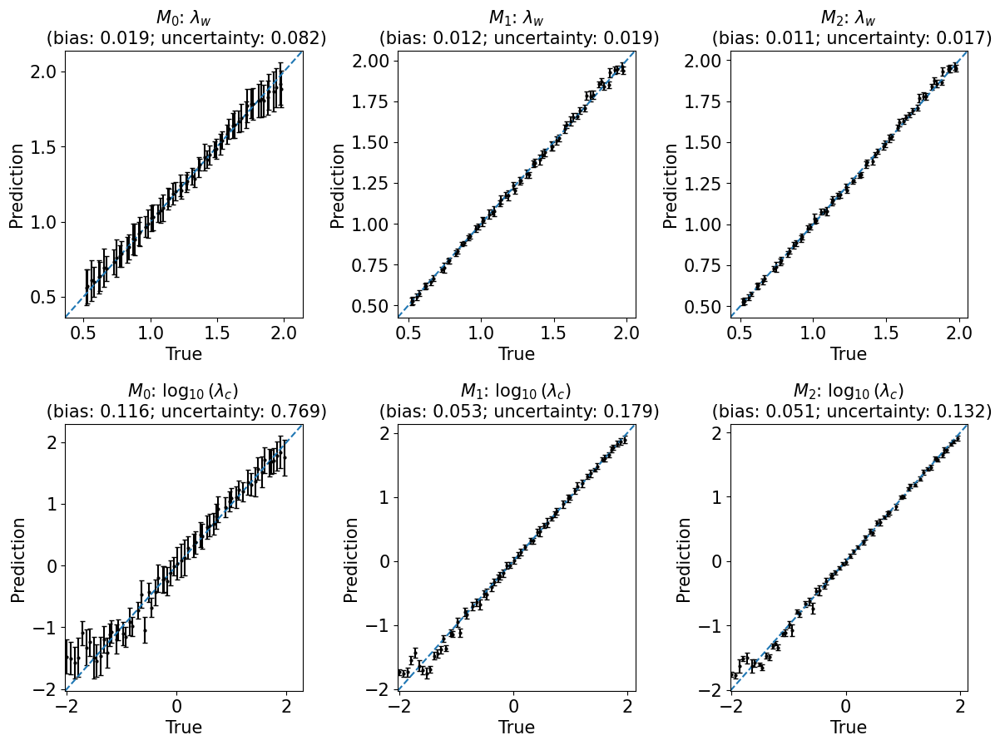
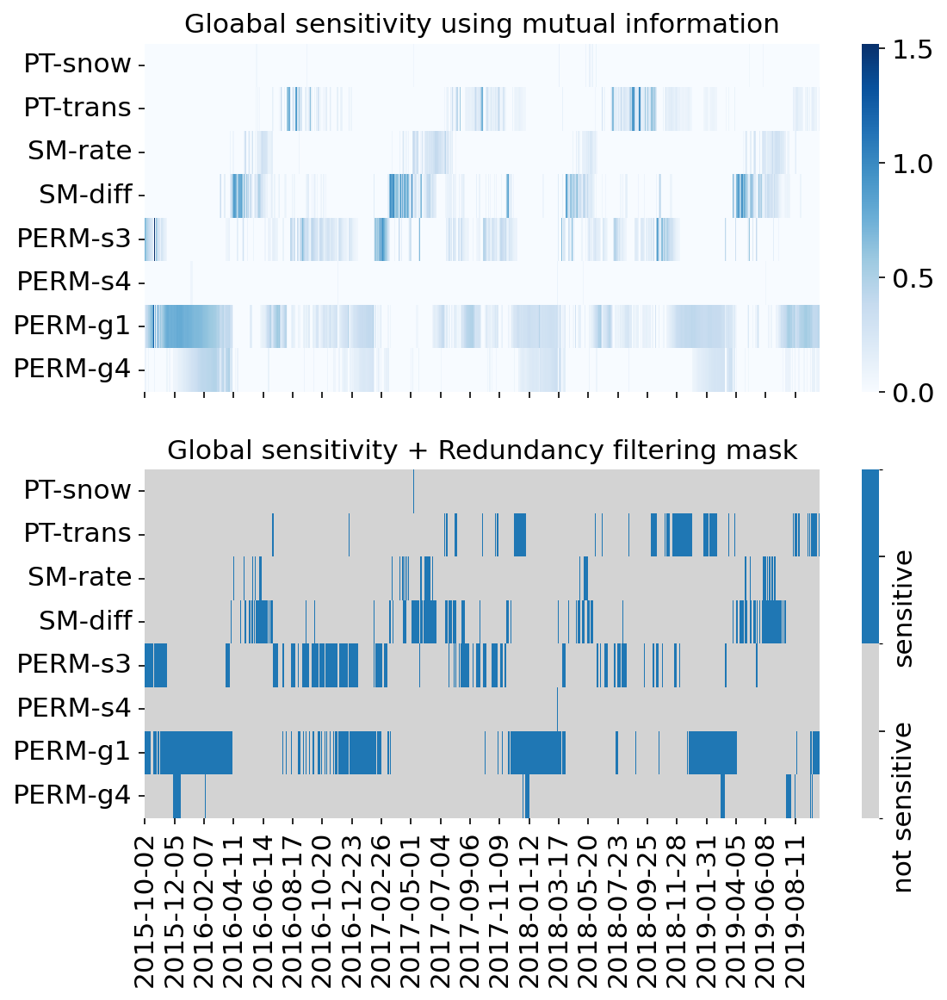
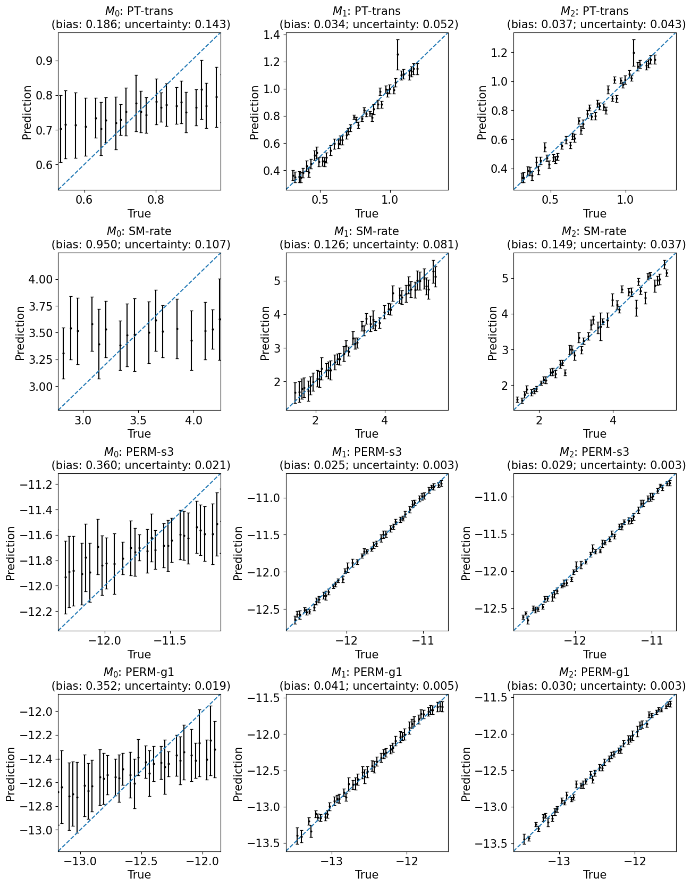

**Peishi Jiang\textsuperscript{1,2}, Aaron Wang\textsuperscript{1}, Susannah M. Burrows\textsuperscript{1}, Naser Mahfouz\textsuperscript{1}, Xingyuan Chen\textsuperscript{1}**

\textsuperscript{1} Atmospheric, Climate, and Earth Sciences Division, Pacific Northwest National Laboratory, Richland, WA, USA  
\textsuperscript{2} Civil, Construction and Environmental Engineering, University of Alabama, Tuscaloosa, AL, USA

# Summary
We present a Knowledge-Informed Mapping toolkit in Python programming language, named KIM, to optimize the development of the mapping $ƒ$ from a vector of inputs $\mathbf{X}$ to a vector of outputs $\mathbf{Y}$. KIM builds on the methodology development of deep learning-based inverse mapping in @Jiang:2023 and @Wang:2025. 
KIM offers a preliminary understanding of data interdependencies while optimizing the training step with uncertainty accounted for. We expect this toolkit will be helpful to glue the model data integration for Earth science applications.

# Statement of need
Striving for scientific hypothesis testing and discovery, Earth scientists oftentimes develop data-driven mappings -- either for inverse modeling, as part of model calibration, or forward modeling, as an emulator. Both approaches benefit from an efficient way of mapping, $ƒ$, that projects from a vector of inputs $\mathbf{X}$ to a vector of outputs $\mathbf{Y}$. 
Such mapping approach has seen successes in addressing inverse and forward problems in multiple studies across Earth sciences [@Krasnopolsky:2003; @HU:2014; @Cromwell:2021; @Mudunuru:2022].

Nevertheless, constructing the mapping $ƒ$ that connects all inputs $\mathbf{X}$ to all outputs $\mathbf{Y}$ is usually challenging due to (1) limited data/simulations for training; (2) uninformative relations between some members of $\mathbf{X}$ and $\mathbf{Y}$; and (3) the structural uncertainty of the mapping $ƒ$. To that, @Jiang:2023 and @Wang:2025 lneveraged the idea of integrating scientific knowledge with deep learning [@Willard:2022] to develop knowledge-informed mapping (KIM). The goal of this paper is to document and open source KIM for a general public usage. \autoref{fig:kim} shows the general procedures of KIM which are detailed in the next section.

{ width=80% }

# Mathematical approach
Consider a vector of inputs $\mathbf{X} = [X_1,...,X_{N_x}]$ and a vector of outputs $\mathbf{Y} = [Y_1,...,Y_{N_y}]$. The objective is to build up a mapping function $f$ from $\mathbf{X}$ to  $\mathbf{Y}$, such that $f: \mathbb{R}^{N_x} \rightarrow \mathbb{R}^{N_y}$, based on $N_e$ pairs/realizations of $\mathbf{X}$ and $\mathbf{Y}$. Instead of developing a lumped mapping, we aim to develop a separate inverse mapping $f_i$ for each $Y_j \in \mathbf{Y}$ by using a reduced space $\mathbf{X}^S_j \in \mathbf{X}$ that is most relevant to $Y_j$, such that $f_j: \mathbb{R}^{N_{x_j}} \rightarrow \mathbb{R}$ (see examples in @Jiang:2023 and @Wang:2025), which involves the following steps.

**Step 1: Filtering by global sensitivity analysis.** We first perform a mutual information-based global sensitivity analysis to narrow down a subset $\mathbf{X}^{S_1}_j$, each of which shares zero information with $Y_j$ such that:

$$\mathbf{X}^{S_1}_j = \{X_i: I(X_i;Y_j) \neq 0 \quad \text{with} \: X_i \in \mathbf{X}\},$$

where $I(X_i;Y_j)$ is the mutual information between $X_i$ and $Y_j$ [@Cover:2006]. Based on the $N_e$ realizations, $I$ is calculated on the joint probability of $X_i$ and $Y_j$ using either binning method or k-nearest-neighbor method. 

**Step 2: Filtering by redundancy check.** Then, we conduct a further assessment that filters out any model output in $\mathbf{X}^{S_1}_j$ whose dynamics are redundant to $Y_j$ given the knowledge of other outputs. This is achieved through a conditional independence test using conditional mutual information [@Cover:2006] given as:

$$\mathbf{X}^{S}_j = \{X_i: I(X_i;Y_j|\mathbf{X}^{S_1}_j \backslash X_i) \neq 0 \quad \text{with} \: X_i \in \mathbf{X}^{S_1}_j \},$$

where $\mathbf{X}^{S_1}_j \backslash X_i$ is the remaining set of $\mathbf{X}^{S_1}_j$ by excluding $X_i$; $I(X_i;Y_j|\mathbf{X}^{S_1}_j \backslash X_i)$ is the conditional mutual information between $X_i$ and $Y_j$ conditioning on $\mathbf{X}^{S_1}_j \backslash X_i$. $I(X_i;Y_j|\mathbf{X}^{S_1}_j \backslash X_i) = 0$ indicates that $X_i$ and $Y_j$ are independent given the knowledge of $\mathbf{X}^{S_1}_j \backslash X_i$. 

**Step 3: Uncertainty aware estimation by training ensemble neural networks.** For each parameter $Y_i$, we train an ensemble of fully-connected neural networks by varying the hyperparameters, including the number of hidden layers, the number of hidden neurons, and the learning rate. We split the $N_e$ model realizations into training, validation, and testing dataset. 
When evaluating the estimation on the test dataset, we further quantified the bias and uncertainty of the prediction as:
\begin{align}
    \text{Bias} &= E(|\mu_w - y|) \notag\\
    \text{Uncertainty} &= E(\sigma_w / |y|) \notag,
\end{align}
where $E$ is the expectation operator; $y$ is the true value; $\mu_w$ and $\sigma_w$ are the mean and standard deviation of the ensemble predictions weighted by their accuracy in the validation set.

# Examples
We present two applications of KIM in performing inverse modeling, with Jupyter notebook provided in the repository to guide the package usage. For each case, we developed three types of inverse mappings: (1) the original inverse mapping without knowledge-informed, denoted as $M_0$; (2) the knowledge-informed inverse mapping only using global sensitivity analysis (Step 1), denoted as $M_1$; and (3) the knowledge-informed inverse mapping using both Step 1 and Step 2, denoted as $M_2$. The configurations can be found in the example jupyter notebook.

**Case 1: Calibrating a cloud chamber model.** Cloud chamber model has been widely applied as a virtual reality of a true cloud chamber to study turbulence, clouds, and their interactions [@Thomas2019scaling; @Wang:2024; @Wang2024dual; @Wang2024glaciation; @Wang2025intercomparison]. The objective of this example is to estimate two key parameters, i.e., the scaling coefficients of wall fluxes ($\lambda_w$) and collision processes ($\lambda_c$) using inverse mapping. To that, an ensemble of 513 model runs were generated based on a model set up detailed in @Wang:2025, by varying the values of the two parameters using Sobol sequence. 27 virtual sensors are configured, each of which 'records' multiple variables including flow properties and cloud properties. 

{ width=80% }

{ width=80% }

**Case 2: Calibrating an integrated hydrological model.** The Advanced Terrestrial Simulator (ATS) is an integrated hydrological models used to simulate hydrological fluxes across a watershed [@Coon:2019]. Here, we calibrated ATS against the streamflow observations at the outlet of Coal Creek watershed, CO, USA. The objective is to estimate eight models parameters categorized into evapotranspiration (ET), snow melting, and subsurface permeability. See @Jiang:2023 for more detailed information.

{ width=80% }

{ width=80% }

# Acknowledgements
This work was supported by both the Laboratory Directed Research and Development Program at Pacific Northwest National Laboratory and the IDEAS-Watersheds project. The Laboratory Directed Research and Development Program at Pacific Northwest National Laboratory is a multiprogram national laboratory operated by Battelle for the U.S. Department of Energy. Pacific Northwest National Laboratory is operated for the DOE by Battelle Memorial Institute under contract DE-AC05-76RL01830. The IDEAS-Watersheds project is funded by the U.S. Department of Energy (DOE), Office of Science (SC) Biological and Environmental Research (BER) program, as part of BER’s Environmental System Science (ESS) program. 

# References