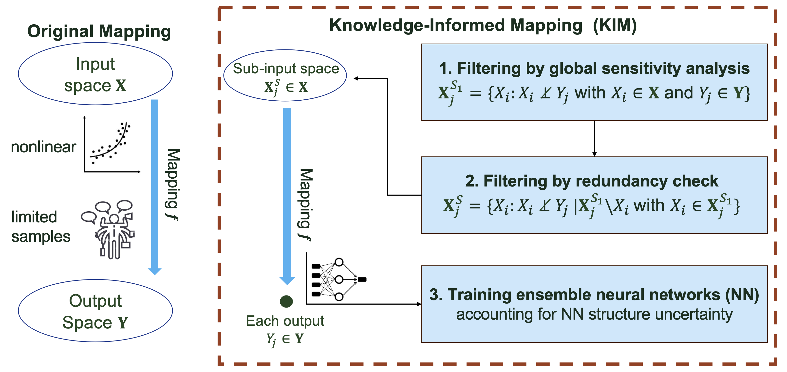

**Peishi Jiang\textsuperscript{1,2}, Aaron Wang\textsuperscript{1}, Susannah M. Burrows\textsuperscript{1}, Naser Mahfouz\textsuperscript{1}, Xingyuan Chen\textsuperscript{1}**

\textsuperscript{1} Atmospheric, Climate, and Earth Sciences Division, Pacific Northwest National Laboratory, Richland, WA, USA  
\textsuperscript{2} Civil, Construction and Environmental Engineering, University of Alabama, Tuscaloosa, AL, USA

# Summary
We present a Knowledge-Informed Mapping toolkit in Python programming language, named KIM, to optimize the development of the mapping $ƒ$ from a vector of inputs $\mathbf{X}$ to a vector of outputs $\mathbf{Y}$. KIM builds on the methodology development of deep learning-based inverse mapping in @Jiang:2023 and @Wang:2025. It involves two key procedures: (1) an exploratory data analysis using information theory to identify the dependency between $\mathbf{X}$ and $\mathbf{Y}$ and filter out both insignificant and redundant inputs through global sensitivity analysis and conditional independence testing; and (2) ensemble learning of $ƒ$ using neural networks to account for its structural uncertainty. KIM offers a preliminary understanding of data interdependencies while optimizing the training step with uncertainty accounted for. We demonstrate the applications of KIM through two use cases of developing inverse mappings for learning the parameters of an integrated hydrological model and a large eddy simulation cloud model. We expect this toolkit will be helpful to glue the model data integration for Earth science applications.

# Statement of need
Striving for scientific hypothesis testing and discovery, Earth scientists oftentimes develop data-driven mappings -- either for inverse modeling, as part of model calibration, or forward modeling, as an emulator. Both approaches benefit from an efficient way of mapping, $ƒ$, that projects from a vector of inputs $\mathbf{X}$ to a vector of outputs $\mathbf{Y}$. While the forward modeling focuses on developmeng an emulator, the inverse modeling involves developing a mapping from model outputs to model parameters, such that once trained, the mapping can directly infer the parameters based on observations. Such mapping approach has seen successes in addressing inverse and forward problems in multiple studies across Earth sciences [@Krasnopolsky:2003; @HU:2014; @Cromwell:2021; @Mudunuru:2022].

Nevertheless, constructing the mapping $ƒ$ that connects all inputs $\mathbf{X}$ to all outputs $\mathbf{Y}$ is usually challenging due to (1) limited data/simulations for training; (2) uninformative relations between some members of $\mathbf{X}$ and $\mathbf{Y}$; and (3) the structural uncertainty of $ƒ$. To that, @Jiang:2023 and @Wang:2025 lneveraged the idea of integrating scientific knowledge with deep learning [@Willard:2022] to develop knowledge-informed mapping (KIM) by using (1) information theory to uncover the dependencies between $\mathbf{X}$ and $\mathbf{Y}$ that guides the design of $f$ and (2) ensemble learning to account for uncertainty due to the model structure error of $f$. The goal of this paper is to document and open source KIM for a general public usage. Figure \autoref{fig:kim} shows the general procedures of KIM which are detailed in the next section.

{ width=80% }

# Mathematical approach
Consider a vector of inputs $\mathbf{X} = [X_1,...,X_{N_x}]$ and a vector of outputs $\mathbf{Y} = [Y_1,...,Y_{N_y}]$. The objective is to build up a mapping function $f$ from $\mathbf{X}$ to  $\mathbf{Y}$, such that $f: \mathbb{R}^{N_x} \rightarrow \mathbb{R}^{N_y}$, based on $N_e$ pairs/realizations of $\mathbf{X}$ and $\mathbf{Y}$. However, it is oftentimes hard to develop an accurate composite $f$, given the limited training data, partially due to the high computational cost of model ensemble simulation. Instead, it would be desirable to develop a separate inverse mapping $f_i$ for each $Y_j \in \mathbf{Y}$ by using a reduced space $\mathbf{X}^S_j \in \mathbf{X}$ that is most relevant to $Y_j$, such that $f_j: \mathbb{R}^{N_{x_j}} \rightarrow \mathbb{R}$ (see examples in @Jiang:2023 and @Wang:2025). The identification of $\mathbf{X}_j$ for a given $Y_j$ involves a two-step filtering as follows.

**Step 1: Filtering by global sensitivity analysis.** We first perform a mutual information-based global sensitivity analysis to narrow down a subset $\mathbf{X}^{S_1}_j$, each of which shares zero information with $Y_j$ such that:

$$\mathbf{X}^{S_1}_j = \{X_i: I(X_i;Y_j) \neq 0 \quad \text{with} \: X_i \in \mathbf{X}\},$$

where $I(X_i;Y_j)$ is the mutual information between $X_i$ and $Y_j$ [@Cover:2006]. Based on the $N_e$ realizations, $I$ is calculated on the joint probability of $X_i$ and $Y_j$ using either binning method or k-nearest-neighbor method. Following @Jiang:2023, a statistical significance test is performed to identify the significant $I$ (i.e., $I(X_i;Y_j) \neq 0$) with a significance level of $1-\alpha$ on 100 bootstrap samples.

**Step 2: Filtering by redundancy check.** Then, we conduct a further assessment that filtered out any model output in $\mathbf{X}^{S_1}_j$ whose dynamics are redundant to $Y_j$ given the knowledge of other outputs. This is achieved through a conditional independence test using conditional mutual information [@Cover:2006] given as:

$$\mathbf{X}^{S}_j = \{X_i: I(X_i;Y_j|\mathbf{X}^{S_1}_j \backslash X_i) \neq 0 \quad \text{with} \: X_i \in \mathbf{X}^{S_1}_j \},$$

where $\mathbf{X}^{S_1}_j \backslash X_i$ is the remaining set of $\mathbf{X}^{S_1}_j$ by excluding $X_i$; $I(X_i;Y_j|\mathbf{X}^{S_1}_j \backslash X_i)$ is the conditional mutual information between $X_i$ and $Y_j$ conditioning on $\mathbf{X}^{S_1}_j \backslash X_i$. $I(X_i;Y_j|\mathbf{X}^{S_1}_j \backslash X_i) = 0$ indicates that $X_i$ and $Y_j$ are independent given the knowledge of $\mathbf{X}^{S_1}_j \backslash X_i$. However, calculating $\mathbf{X}^{S_1}_j \backslash X_i$. $I(X_i;Y_j|\mathbf{X}^{S_1}_j \backslash X_i)$ faces the curse of dimensionality due to the potential high dimension in $\mathbf{X}^{S_1}_j$. 

To address this, we leverage the idea of Peter-Clark algorithm for causal inference detection [@Spirtes:2001] to evaluate the zeroness of a high-dimensional conditional mutual information by gradually adding conditioning variables. Specifically, we approximated $I(X_i;Y_j|\mathbf{X}^{S_1}_j \backslash X_i)$ via $I(X_i;Y_j|\mathbf{X}^{S_2}_j)$, where $\mathbf{X}^{S_2}_j$ is a subset of $\mathbf{X}^{S_1}_j \backslash X_i$ with cardinality $\leq 3$. Starting with the cardinality of one, i.e. $|\mathbf{X}^{S_2}_j|=1$,  we conducted statistical significance test on assessing $I(X_i;Y_j|\mathbf{X}^{S_2}_j) = 0$ by exhausting all the combinations out of $\mathbf{X}^{S_1}_j \backslash X_i$ that constitute $\mathbf{X}^{S_2}_j$. We removed $X_i$ from $\mathbf{X}^{S}_j$ when $I(X_i;Y_j|\mathbf{X}^{S_2}_j) = 0$.

**Step 3: Uncertainty aware estimation by training ensemble neural networks.** For each parameter $Y_i$, we train an ensemble of fully-connected neural networks by varying the hyperparameters, including the number of hidden layers, the number of hidden neurons, and the learning rate. We split the $N_e$ model realizations into training, validation, and testing dataset. For each model inference, the ensemble learning enables the predictions through weighted mean $\mu_w$ and weighted standard deviation $\sigma_w$ as:
\begin{align}
    \mu_w &= \sum^{N_e}_{k=1} w_k \cdot \tilde{y_k} \notag\\
    \sigma_w &= \sqrt{\sum^{N_e}_{k=1} w_k \cdot (\tilde{y_k}-\mu_w)^2}, \notag
\end{align}
where $N_e$ is the number of ensemble neural networks; $\tilde{y_k}$ is the estimation by the $k$ th neural network; $w_k$ is the weight to the $k$ th prediction and is calculated through the corresponding loss value in the validation dataset $\mathcal{L}_{k,\text{val}}$, such that $w_k = \frac{1/\mathcal{L}_{k,\text{val}}}{\sum^{N_e}_{k=1} 1/\mathcal{L}_{k,\text{val}}}$.

When evaluating the estimation on the test dataset, we further quantified the bias and uncertainty of the prediction as:
\begin{align}
    \text{Bias} &= E(|\mu_w - y|) \notag\\
    \text{Uncertainty} &= E(\sigma_w / |y|) \notag,
\end{align}
where $E$ is the expectation operator and $y$ is the true value.

# Examples
We present two applications of KIM in performing inverse modeling, with Jupyter notebook provided in the repository to guide the package usage. For each case, we developed three types of inverse mappings: (1) the original inverse mapping without knowledge-informed, denoted as $M_0$; (2) the knowledge-informed inverse mapping only using global sensitivity analysis (Step 1), denoted as $M_1$; and (3) the knowledge-informed inverse mapping using both Step 1 and Step 2, denoted as $M_2$. 100 neural networks, $N_e=1$, are trained for each mapping. The remaining configurations can be found in the example jupyter notebook.

**Case 1: Calibrating a cloud chamber model.** Cloud chamber model has been widely applied as a virtual reality of a true cloud chamber to study both turbulence and clouds and reveal aerosol–cloud–turbulence interactions [@Wang:2024]. The objective of this example is to estimate two key parameters, i.e., wall fluxes ($\lambda_w$) and collision processes ($\lambda_c$) using inverse mapping. To that, an ensemble of 513 model runs were generated based on a model set up shown in Figure TBD, by varying the values of the two parameters using Sobol sequence. 27 Virtual sensors are configured, each of which 'records' multiple variables including flow properties and cloud properties. The statistics of these variables, calculated over six 5-min periods, are used as the inputs of the inverse mappings, including the temporal standard deviation of vertical velocity ($W$ std), the temporal mean of temperature ($T$ mean), the temporal standard deviation of temperature ($T$ std), the temporal mean of supersaturation ($SS$ mean), the temporal standard deviation of supersaturation ($SS$ std), the mean radius of droplet size distribution (DSD) ($R$ mean, with $R$ representing radius hereafter), the standard deviation of radius ($R$ std), the skewness of radius ($R$ skew), and the kurtosis of radius ($R$ kurt).

Figure \autoref{fig:cc-1} shows the sensitivity analysis and the redundancy check. These two steps greatly reduce the total number of critical model states as the inputs to the inverse mappings. For $\lambda_w$, it drops from 1458 first to 1168 (via global sensitivity analysis) and then to 1043 (via redundancy checks). For the logarithm of $\lambda_c$, it is reduced to only 336 model states. The corresponding training results in the test dataset are shown in Figure \autoref{fig:cc-2}. It is obvious that the two KIMs, i.e., $M_1$ and $M_2$, outperforms the original inverse mapping that takes all 1043 as the inputs, with reduced bias and uncertainty.

{ width=80% }

{ width=80% }

**Case 2: Calibrating an integrated hydrological model.** The Advanced Terrestrial Simulator (ATS) is an integrated hydrological models used to simulate hydrological fluxes across a watershed [@Coon:2019]. Here, we calibrated ATS against the streamflow observations at the outlet of Coal Creek watershed, CO, USA. The objective is to estimate eight models parameters categorized into evapotranspiration (ET), snow melting, and subsurface permeability. See @Jiang:2023 for more detailed information.

The mutual information-based sensitivity analysis and the redundancy filtering are shown in Figure \autoref{fig:ats-1}. Similar to the cloud chamber case, the two steps greatly narrow down the streamflows that are useful to inform the estimation of each parameter. Figure \autoref{fig:ats-2} shows the corresponding scatter plots between prediction and true for the test dataset, where the bias and uncertainty are drastically lowered by using the two KIMs.

{ width=80% }

{ width=80% }

Both examples demosntrates the improved performance of inverse modeling by using KIM. It illustrates the robustness of the proposed method developing data-driven mappings using knowledge-informed techniques and ensemble learning.

# Acknowledgements
This work was funded by the Laboratory Directed Research and Development Program at Pacific Northwest National Laboratory. The Laboratory Directed Research and Development Program at Pacific Northwest National Laboratory is a multiprogram national laboratory operated by Battelle for the U.S. Department of Energy. Pacific Northwest National Laboratory is operated for the DOE by Battelle Memorial Institute under contract DE-AC05-76RL01830. This paper describes objective technical results and analysis. Any subjective views or opinions that might be expressed in the paper do not necessarily represent the views of the United States Department of Energy or the United States Government. The United States Government retains and the publisher, by accepting the article for publication, acknowledges that the United States Government retains a non-exclusive, paidup, irrevocable, world-wide license to publish, or reproduce the published form of this manuscript, or allow others to do so, for United States Government purposes.

# References

<!-- TBD

Citations to entries in paper.bib should be in
[rMarkdown](http://rmarkdown.rstudio.com/authoring_bibliographies_and_citations.html)
format.

If you want to cite a software repository URL (e.g. something on GitHub without a preferred
citation) then you can do it with the example BibTeX entry below for @fidgit.

For a quick reference, the following citation commands can be used:
- `@author:2001`  ->  "Author et al. (2001)"
- `[@author:2001]` -> "(Author et al., 2001)"
- `[@author1:2001; @author2:2001]` -> "(Author1 et al., 2001; Author2 et al., 2002)"

# Figures

TBD

Figures can be included like this:

and referenced from text using \autoref{fig:example}.

Figure sizes can be customized by adding an optional second parameter:
{ width=20% }

# Acknowledgements

TBD

We acknowledge contributions from Brigitta Sipocz, Syrtis Major, and Semyeong
Oh, and support from Kathryn Johnston during the genesis of this project.

# References -->